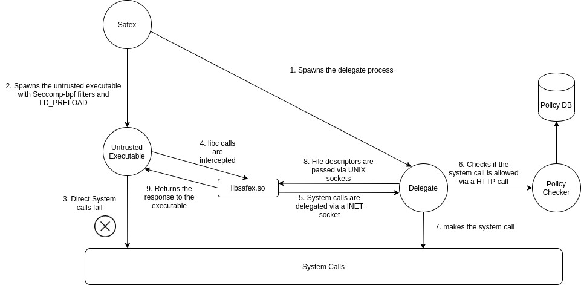

# Safex
## System call delegation using library interception

### Design



For design decisions and architecture explanations, please go through our report

### HOW TO Compile and Run.

> ⚠️ **Please run all the below mentioned commands in the safex code directory only!!**

* [Policy Checker](#policy-checker)
* [Safex](#safex-utility)

### Policy Checker

#### Prerequisites

python 3, python-pip3


#### Using the policy generator

Policy generator is used to produce a yaml file with that dictates the access permissions. This yaml file contains details about the default actions for read/write operations along with the exceptions. This generator can also reuse the existing policy files to build a new policy file. The generated policy file is used by the policy checker service to allow/disallow system calls.\
\
The Usage of this utility is mentioned below.

```
usage: ./policy_generator.py [-h] [--allow_all_reads]
                             [--allow_all_writes]
                             [--exception EXCEPTION [EXCEPTION ...]]
                             [--reuse REUSE [REUSE ...]]
                             out_file

Generate a policy file based on the input parameters.

positional arguments:
  out_file              Output Policy File.

optional arguments:
  -h, --help            show this help message and exit

  --allow_all_reads     Use the flag to allow all reads. Default : deny

  --allow_all_writes    Use the flag to allow all writes. Default : deny

  --exception EXCEPTION [EXCEPTION ...]
                        List of read and write exceptions to the
                        the default access provided.

  --reuse REUSE [REUSE ...]
                        Resuse existing policies from the existing
                        policy files.
```

Sample Commnd to run the utility -

```
bash -c "./policy_generator.py new_policy.yaml --allow_all_reads --exception r=/home/lalith/Templates/safex/*,/tmp/delegate*"
```
This would generate a policy file called "new_policy.yaml" in the project directory, with the following rules.

Sample ouput policy file generated by the utility -

```
DefaultRead: allow
DefaultWrite: deny
Exceptions:
  R:
  - /tmp/delegate.*$
  - /home/lalith/Templates/safex/.*$
  W: []
```

#### Install dependencies

`pip3 install -r requirements.txt`

#### Starting the policy checker service

`python3 policy_checker.py`

Keep this running


### Safex Utility

> ⚠️ **Run policy checker before running the safex utility!!**

In a new terminal

#### How to compile

`cd safex`

`make clean all`

#### How to use

`./safex --policy <policy_name> <command_to_execute>`

#### How to test
1. cd into the safex folder

`cd safex`

2. Create a new policy blocking all writes

`bash -c "./policy_generator.py policy.yaml --allow_all_reads"`

3. Compile the test program test_creat.c

`gcc test/test_creat.c`

4. Run the test program with the policy created

`./safex --policy policy.yaml ./a.out`

It should not make a new file called as creat_text

5. Now create a new policy to allow all writes

`bash -c "./policy_generator.py new_policy.yaml --allow_all_reads --allow_all_writes"`

6. Run the test program with the new policy created

`./safex --policy new_policy.yaml ./a.out`

7. It should create a new file called creat_text in the directory.

#### References
* https://openforums.blog/2016/08/07/open-file-descriptor-passing-over-unix-domain-sockets/ - Followed this to understand how passing file descriptors between processes work. We have reused some of the code here

* https://gist.github.com/fntlnz/08ae20befb91befd9a53cd91cdc6d507 - Followed this to understand how seccomp-bpf filters are applied. We have reused some of the code here

* Thread-safe logging library <https://github.com/rxi/log.c>  - We have used log.c and log.h to enable thread-safe logging mechnism in our project.
